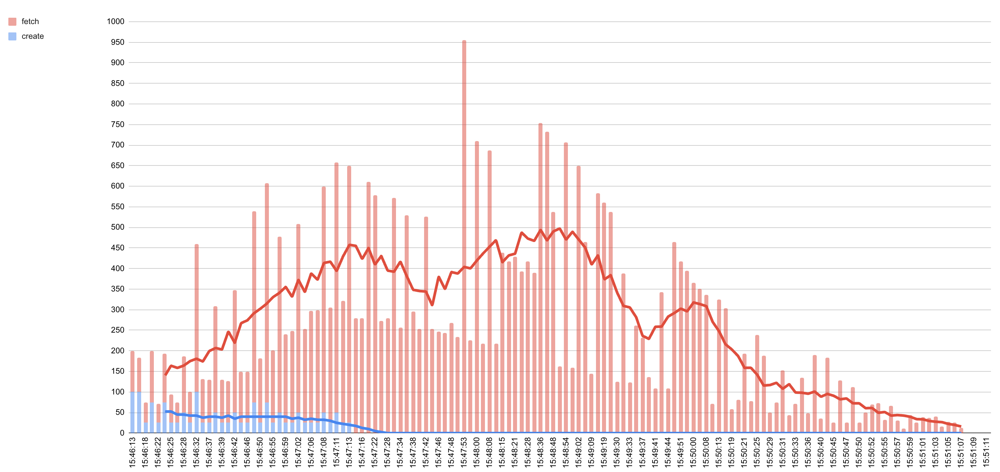

# НИЯУ МИФИ. Лабораторная работа №4. Краснопольский Иван, Б21-525. 2023

## Предметная область

Система получения данных с Etherscan, предназначенная для загрузки исходного кода смарт-контракта на основе адреса
контракта.

### Процесс взаимодействия

1. Взаимодействие начинается с отправки пользователем запроса на API сервер, включающего адрес контракта
2. Сервер регистрирует запрос, записывая контракт в базу данных и назначая ему статус `CREATED`, после чего контракт
   перенаправляется в очередь для обработки
3. Модуль парсинга последовательно обрабатывает контракты из очереди. Модуль присваивает контракту статус `PROCESS` и,
   завершив работу, обновляет статус контракта в базе данных на `SUCCESS`. Если в процессе обработки произошла ошибка,
   статус контракта устанавливается `ERROR`
4. Пользователь имеет возможность отправить запрос на API для получения информации о статусе обработки. После завершения
   обработки доступна загрузка кода контракта

### Параметры работы системы

- Стандартная интенсивность трафика составляет 100 RPS
- В периоды пиковых нагрузок интенсивность может достигать 1000 RPS

### Технологический стек

- FastAPI - бэкенд
- MySQL - СУБД
- RabbitMQ - брокер сообщений

Выбор RabbitMQ обусловлен его способностью эффективно управлять очередями обработки без избыточной сложности,
необходимой для масштабирования системы в Kafka, чье применение в данном контексте представляется излишним.

## Развертывание

### Подготовка среды

1. Скопировать файл `deploy/config/.env.sample` в файл `deploy/config/.env` и поменять секретные значения:
   ```bash
   cp deploy/config/.env.sample deploy/config/.env
   ```

### Подготовка среды для тестирования

1. Создать и активировать виртуальную среду:
   ```bash
   poetry env use python3
   poetry shell
   ```
2. Установить зависимости:
   ```bash
   poetry install --no-root
   ```
3. Установить директорию проекта:
   ```bash
   export PYTHONPATH="$(pwd)/src";
   ```

### Запуск сервисов

1. Запустить контейнеры:
   ```bash
   docker compose -f deploy/docker-compose.yaml up -d
   ```

### Запуск тестирования

1. Перейти в директорию `test`:
   ```bash
   cd test
   ```
2. Запустить тестирование:
   ```bash
   python3 stresser.py
   ```

## Нагрузочное тестирование

### Принцип тестирования

Для проведения нагрузочного тестирования используется библиотека асинхронных HTTP запросов "Aiohttp". Создается
несколько процессов, каждый из которых раз в секунду отправляет одновременно большое количество запросов на парсинг
контракта и сохраняет адреса контрактов. Конкурентно с созданием контрактов, раз в секунду отправляются запросы для
получения статуса контрактов. Создание контрактов длится 1 минуту, получение статуса контрактов длится до тех пор, пока
все контракты не будут иметь статус `SUCCESS` или `ERROR`, иными словами, пока все контракты не будут обработаны.

### Результаты тестирования



На графике видно, что в первую минуту тестирования происходит отправление запросов на парсинг контрактов, причем с
каждой итерацией количество запросов на обновления статуса контрактов возрастает, так как сервис парсинга не успевает
обработать все входящие запросы. Спустя минуту остаются только запросы на обновления статуса контрактов, которые в пике
достигают 1000 запросов в секунду. С каждой итерацией количество запросов на обновление статуса понижается линейно с
тем, как сервис парсинга обрабатывает контракты. Спустя 5 минут после запуска тестирования обработка всех контрактов
завершается.

## Заключение

В ходе данной работы была разработана система из двух компонентов: API сервера и сервиса парсинга смарт-контактов.
Компоненты взаимодействуют между собой с помощью брокера сообщений RabbitMQ. Взаимодействие через брокер сообщений
значительно повышает надежность и пропускную способность системы, что было продемонстрировано с помощью нагрузочного
тестирования. Во время тестирования пиковая нагрузка на систему достигала 1000 RPS, несмотря на что все запросы были
успешно обработаны. 
