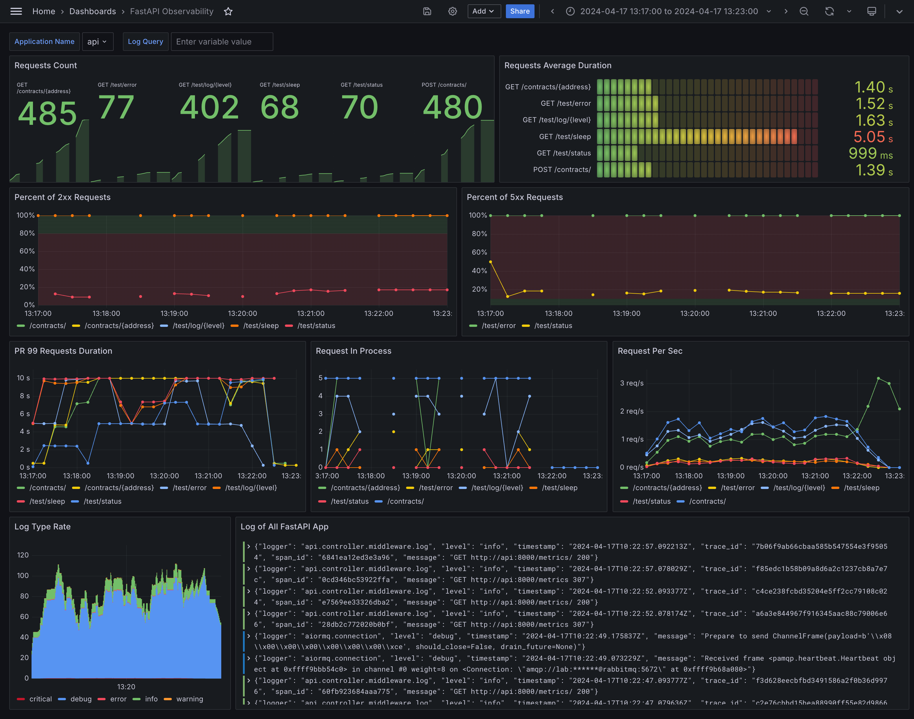
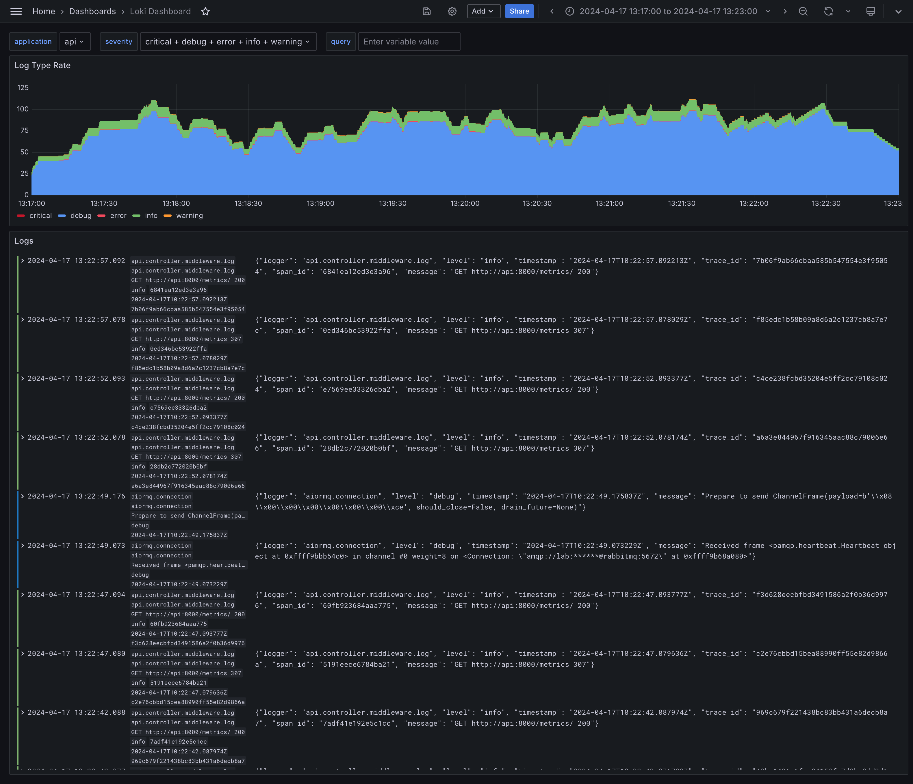
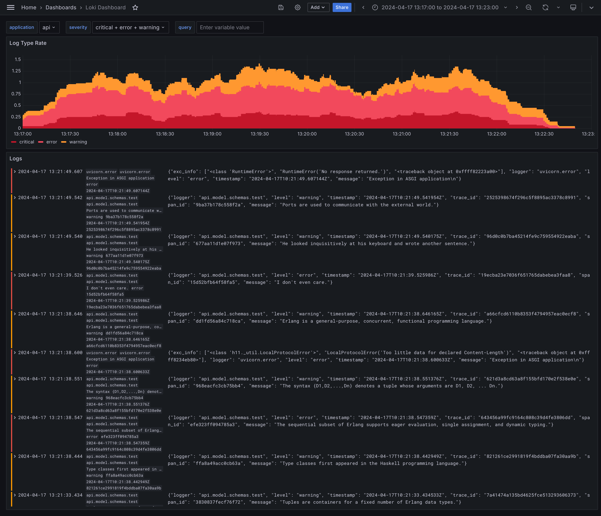
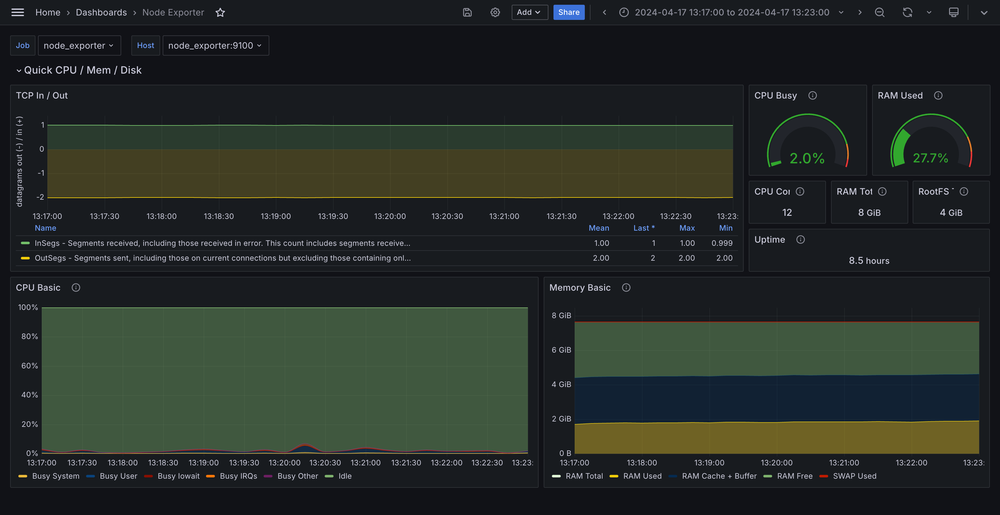
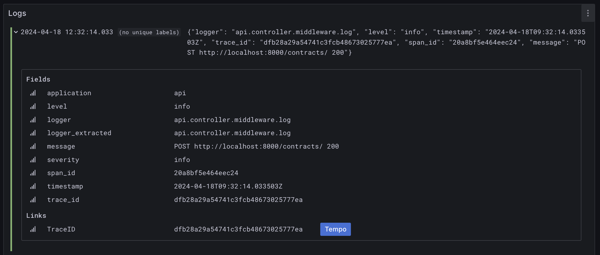
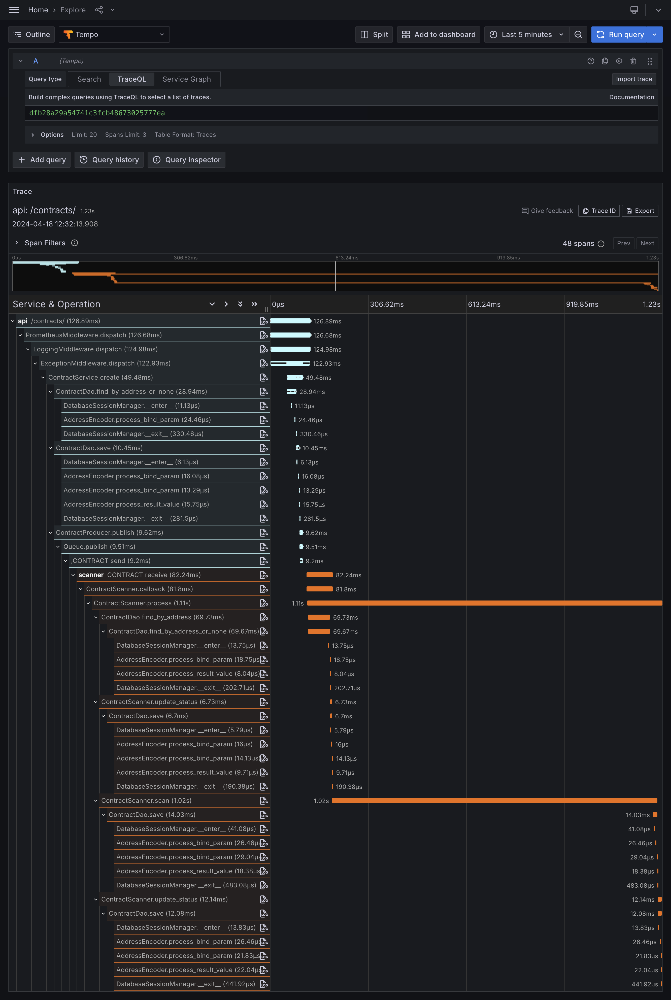
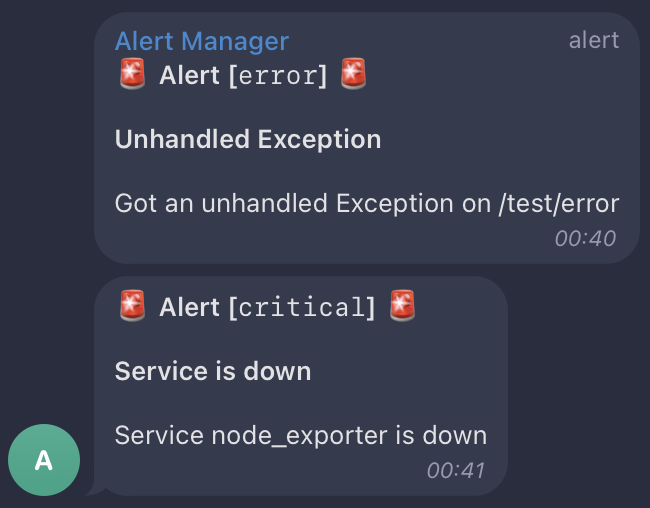

# НИЯУ МИФИ. Лабораторная работа №5. Краснопольский Иван, Б21-525. 2024

## Предметная область

Система получения данных с Etherscan, предназначенная для загрузки исходного кода смарт-контракта на основе адреса
контракта.

### Процесс взаимодействия

1. Взаимодействие начинается с отправки пользователем запроса на API сервер, включающего адрес контракта
2. Сервер регистрирует запрос, записывая контракт в базу данных и назначая ему статус `CREATED`, после чего контракт
   перенаправляется в очередь для обработки
3. Модуль парсинга последовательно обрабатывает контракты из очереди. Модуль присваивает контракту статус `PROCESS` и,
   завершив работу, обновляет статус контракта в базе данных на `SUCCESS`. Если в процессе обработки произошла ошибка,
   статус контракта устанавливается `ERROR`
4. Пользователь имеет возможность отправить запрос на API для получения информации о статусе обработки. После завершения
   обработки доступна загрузка кода контракта

### Параметры работы системы

- Стандартная интенсивность трафика составляет 100 RPS
- В периоды пиковых нагрузок интенсивность может достигать 1000 RPS

### Технологический стек

- FastAPI - бэкенд
- MySQL - СУБД
- RabbitMQ - брокер сообщений
- Node Exporter - сбор системных метрик
- Prometheus - сбор и аналитика метрик
- AlertManager - сервис уведомлений
- Loki - сбор и аналитика логов
- Tempo - сбор и аналитика трейсов
- Grafana - визуализация метрик

Выбор RabbitMQ обусловлен его способностью эффективно управлять очередями обработки без избыточной сложности,
необходимой для масштабирования системы в Kafka, чье применение в данном контексте представляется излишним.

Выбор Grafana Stack обусловлен удобностью настройки, большим выбором дополнительных сервисов вроде Tempo и Loki, а также
широкой поддержкой сообщества.

## Развертывание

### Подготовка среды

1. Скопировать файл `deploy/config/.env.sample` в файл `deploy/config/.env` и поменять секретные значения:
   ```bash
   cp deploy/config/.env.sample deploy/config/.env
   ```
2. Скопировать файл `deploy/config/alertmanager/alertmanager.yml.sample` в
   файл `deploy/config/alertmanager/alertmanager.yml` и поменять секретные значения:
   ```bash
   cp deploy/config/alertmanager/alertmanager.yml.sample deploy/config/alertmanager/alertmanager.yml
   ```

### Подготовка среды для тестирования

1. Создать и активировать виртуальную среду:
   ```bash
   poetry env use python3
   poetry shell
   ```
2. Установить зависимости:
   ```bash
   poetry install --no-root
   ```
3. Установить директорию проекта:
   ```bash
   export PYTHONPATH="$(pwd)/src";
   ```

### Запуск сервисов

1. Запустить контейнеры:
   ```bash
   docker compose -f deploy/docker-compose.yaml up -d
   ```

### Запуск тестирования

1. Перейти в директорию `test`:
   ```bash
   cd test
   ```
2. Запустить тестирование:
   ```bash
   python3 stresser.py
   ```

## Нагрузочное тестирование

### Принцип тестирования

Для проведения нагрузочного тестирования используется библиотека асинхронных HTTP запросов "Aiohttp". Создается
несколько процессов, каждый из которых раз в секунду отправляет одновременно большое количество запросов на парсинг
контракта и сохраняет адреса контрактов. Конкурентно с созданием контрактов, раз в секунду отправляются запросы для
получения статуса контрактов. Создание контрактов длится 1 минуту, получение статуса контрактов длится до тех пор, пока
все контракты не будут иметь статус `SUCCESS` или `ERROR`, иными словами, пока все контракты не будут обработаны.

Помимо создания контрактов, в течение минуты отправляются запросы на тестовые эндпоинты, которые генерируют случайные
логи, вызывают случайные ошибки, а также создают случайные задержки для имитации работы системы в разных условиях.

### Дэшборды

#### Observability



Этот дэшборд предоставляет наглядное представление основных показателей, получаемых из API сервиса. На нем можно видеть
количество запросов, поступающих на каждый конечный пункт, среднее время ответа с каждого эндпоинта, процент ответов с
кодами 2xx и 5xx, графики времени ответа, количество запросов, находящихся в ожидании, и количество запросов в секунду
на каждый эндпоинт. Также здесь присутствует график объема логов и самыми логами, разделенными по типам.

#### Loki



Представленный раздел предоставляет подробную информацию о логах системы. Здесь можно видеть график, отображающий объем
логов в течение определенного периода времени, а также сами логи, разбитые по уровням.



Логи могут быть отфильтрованы по уровню логов и по названию сервиса, который их генерирует. Данный график отображает
логи, отфильтрованные по уровням "critical", "error" и "warning".

#### Node Exporter



График предоставляет информацию о нагрузке на систему, включая количество открытых сетевых соединений, нагрузку на
центральный процессор и использование оперативной памяти. Кроме того, он предоставляет общую информацию о системе, такую
как количество доступных ядер процессора и объем оперативной памяти.

### Tracing



Дэшборд логов интегрирован с Tempo, что обеспечивает возможность отображения трейсов системы. В каждом логе, где
присутствует идентификатор трейса, доступна кнопка, которая перенаправляет на просмотр полного трейса.



Этот трейс системы представляет собой визуализацию выполнения запроса, который проходит через два отдельных компонента:
API и сервис сканнера. Взаимодействие между этими компонентами осуществляется через брокер сообщений. Голубая часть
трейса отображает первую половину выполнения запроса, которая происходит в API, в то время как оранжевая часть
представляет выполнение в сервисе сканнера. Стоит отметить, что наибольшее время выполнения занимает искусственная
задержка, эмулирующая сетевой запрос к внешнему сервису.

### Alerting



В разработанной системе настроено оповещение о событиях, требующих внимания разработчиков. Это включает уведомления об
отказе какого-либо компонента системы и уведомления о необработанных ошибках на сервисе API. В момент возникновения
любого из таких инцидентов система направляет уведомления в Telegram чат через бота, предоставляя основную информацию об
инциденте.

## Заключение

В процессе данной работы в ранее разработанную систему, состоящую из двух компонентов (API сервера и сервиса парсинга
смарт-контрактов), была интегрирована система мониторинга. Эта система включает в себя сбор логов и метрик каждого
компонента, а также предоставляет оповещения об инцидентах, требующих внимания разработчиков. Кроме того, в ходе работы
была интегрирована система распределенных трейсов, которая позволяет оценить взаимодействие между отдельными
компонентами системы в рамках одного трейса. Для визуализации собранных данных были спроектированы наглядные дэшборды
Grafana.
