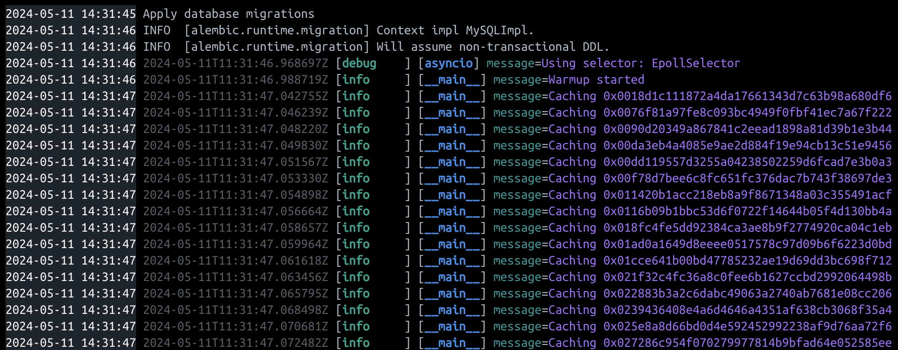
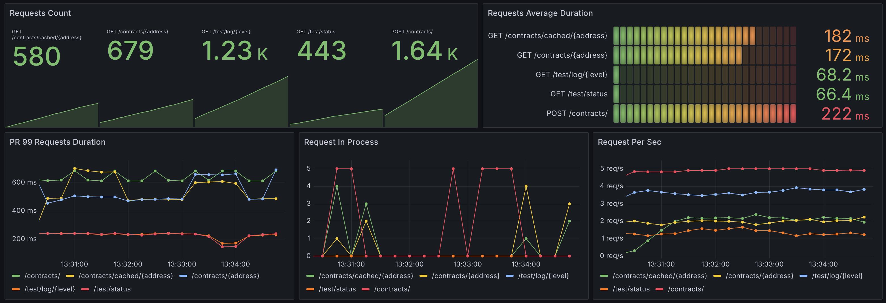
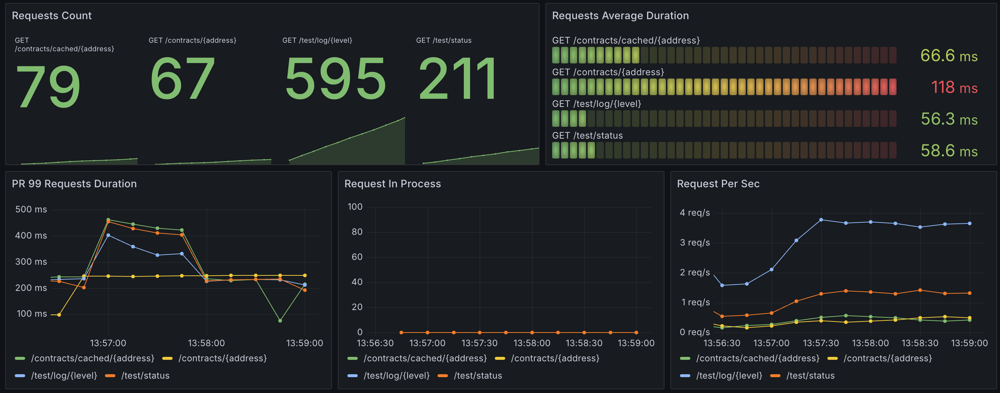

# НИЯУ МИФИ. Лабораторная работа №6. Краснопольский Иван, Б21-525. 2024

## Предметная область

Система получения данных с Etherscan, предназначенная для загрузки исходного кода смарт-контракта на основе адреса
контракта.

### Процесс взаимодействия

1. Взаимодействие начинается с отправки пользователем запроса на API сервер, включающего адрес контракта
2. Сервер регистрирует запрос, записывая контракт в базу данных и назначая ему статус `CREATED`, после чего контракт
   перенаправляется в очередь для обработки
3. Модуль парсинга последовательно обрабатывает контракты из очереди. Модуль присваивает контракту статус `PROCESS` и,
   завершив работу, обновляет статус контракта в базе данных на `SUCCESS`. Если в процессе обработки произошла ошибка,
   статус контракта устанавливается `ERROR`
4. Пользователь имеет возможность отправить запрос на API для получения информации о статусе обработки. После завершения
   обработки доступна загрузка кода контракта

### Параметры работы системы

- Стандартная интенсивность трафика составляет 100 RPS
- В периоды пиковых нагрузок интенсивность может достигать 1000 RPS

### Технологический стек

- FastAPI - бэкенд
- MySQL - СУБД
- RabbitMQ - брокер сообщений
- Redis - хранилище кэша
- Node Exporter - сбор системных метрик
- Prometheus - сбор и аналитика метрик
- AlertManager - сервис уведомлений
- Loki - сбор и аналитика логов
- Tempo - сбор и аналитика трейсов
- Grafana - визуализация метрик

Выбор RabbitMQ обусловлен его способностью эффективно управлять очередями обработки без избыточной сложности,
необходимой для масштабирования системы в Kafka, чье применение в данном контексте представляется излишним.

Выбор Grafana Stack обусловлен удобностью настройки, большим выбором дополнительных сервисов вроде Tempo и Loki, а также
широкой поддержкой сообщества.

Выбор Redis обусловлен удобством интеграции и эффективностью управления кэшем.

### Кэширование

#### Принцип кэширования

В системе настроено кэширование эндпоинта `/api/contracts/cached/{address}`. Когда пользователь впервые отправляет
запрос на получение статуса конкретного контракта, информация о контракте сохраняется в кэше в течение 5 минут. Если
сервис парсинга контрактов обновляет информацию о контракте, то данные удаляются из кэша, чтобы поддерживать
актуальность.

#### Прогрев

Во время запуска контейнеров, запускается контейнер `warmup`, который получает последние контракты из БД со
статусов `SUCCESS` и помещает информацию о них в кэш:



## Развертывание

### Подготовка среды

1. Скопировать файл `deploy/config/.env.sample` в файл `deploy/config/.env` и поменять секретные значения:
   ```bash
   cp deploy/config/.env.sample deploy/config/.env
   ```
2. Скопировать файл `deploy/config/alertmanager/alertmanager.yml.sample` в
   файл `deploy/config/alertmanager/alertmanager.yml` и поменять секретные значения:
   ```bash
   cp deploy/config/alertmanager/alertmanager.yml.sample deploy/config/alertmanager/alertmanager.yml
   ```

### Подготовка среды для тестирования

1. Создать и активировать виртуальную среду:
   ```bash
   poetry env use python3
   poetry shell
   ```
2. Установить зависимости:
   ```bash
   poetry install --no-root
   ```
3. Установить директорию проекта:
   ```bash
   export PYTHONPATH="$(pwd)/src";
   ```

### Запуск сервисов

1. Запустить контейнеры:
   ```bash
   docker compose -f deploy/docker-compose.yaml up -d
   ```

### Запуск тестирования

1. Перейти в директорию `test`:
   ```bash
   cd test
   ```
2. Запустить тестирование:
   ```bash
   python3 stresser.py
   ```

## Нагрузочное тестирование

### Принцип тестирования

Для проведения нагрузочного тестирования используется библиотека асинхронных HTTP запросов "Aiohttp". Создается
несколько процессов, каждый из которых раз в секунду отправляет одновременно большое количество запросов на парсинг
контракта и сохраняет адреса контрактов. Конкурентно с созданием контрактов, раз в секунду отправляются запросы для
получения статуса контрактов. Создание контрактов длится 1 минуту, получение статуса контрактов длится до тех пор, пока
все контракты не будут иметь статус `SUCCESS` или `ERROR`, иными словами, пока все контракты не будут обработаны.

Помимо создания контрактов, в течение минуты отправляются запросы на тестовые эндпоинты, которые генерируют случайные
логи, вызывают случайные ошибки, а также создают случайные задержки для имитации работы системы в разных условиях.

### Дэшборды

#### Без прогрева



На данном дэшборде видно, что без прогрева эндпоинт с кешированием отвечает в среднем дольше, чем эндпоинт без
кэширования. Это обусловлено низким количеством попаданий, из-за чего почти при каждом новом запросе нужно кэшировать
информацию о контракте. Таким образом, накладные ресурсы на кэширование незначительно увеличивают время ответа.

#### С прогревом



На данном дэшборде видно, что в отличии от тестирования без прогрева эндпоинт с кешированием отвечает примерно на 50 мс
быстрее, чем эндпоинт без кэширования. Это обусловлено более высокой скоростью кэша по сравнению с базой данных.

## Заключение

В процессе данной работы в ранее разработанную систему, состоящую из двух компонентов (API сервера и сервиса парсинга
смарт-контрактов) и системы мониторинга, была интегрирована система кэширования и прогрева. Были проведены тесты работы
системы с прогревом и без, в результате который система с прогревом показала значительно лучшие результаты по сравнению
с системой без прогрева. Кроме того, замеры показали значительно большую скорость ответа от кэша по сравнению с базой
данных.
